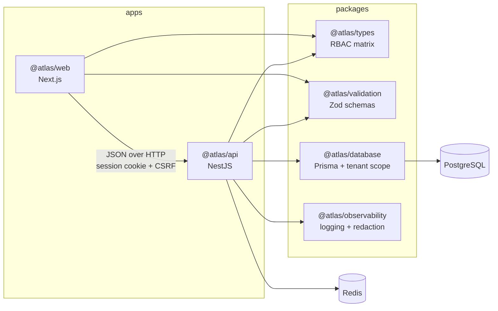

# ATLAS

Operations infrastructure for teams that run software. A multi-tenant SaaS
platform where organizations manage workspaces, projects, work items, teams,
members, API keys and an audit trail with tenant isolation, role-based
access control, and an interface built for people who keep it open all day.

This is a portfolio project, built to be read. The decisions are argued in the
code and in [`docs/`](./docs) rather than left implicit, including the ones
that turned out to be wrong.

---

## Running it

**Prerequisites:** Node 22 (`.nvmrc`), pnpm 10, Docker.

```bash
pnpm install
```

```bash
cp .env.example .env
```

```bash
pnpm infra:up
```

Postgres on **5434**, Redis on **6380**, and Mailpit for outbound mail. Both
data stores are deliberately off their default ports so the stack does not
collide with anything already running locally.

```bash
pnpm db:migrate:deploy && pnpm db:seed
```

```bash
pnpm dev
```

|          |                                |
| -------- | ------------------------------ |
| Web      | http://localhost:3000          |
| API      | http://localhost:4000/api/v1   |
| API docs | http://localhost:4000/api/docs |
| Mailpit  | http://localhost:8025          |

### Signing in

The seed creates two organizations. **Northstar Systems** is a populated
platform team; **Meridian Labs** is deliberately sparse, and exists so you can
sign in as one of its members and confirm none of Northstar's data is
reachable.

Every account uses the password `atlas-demo-password`.

| Role   | Email                                 |
| ------ | ------------------------------------- |
| Owner  | `dana.whitfield@northstar.example`    |
| Admin  | `marcus.oyelaran@northstar.example`   |
| Member | `priya.raghunathan@northstar.example` |
| Viewer | `rosa.delacruz@northstar.example`     |

Dana owns Northstar and is an admin of Meridian, so the organization switcher
is meaningful without inventing a second identity.

Signing in as the Viewer is the quickest way to see authorization working: the
interface offers no administrative controls, and the API refuses the requests
anyway.

---

## What this is built from

|              |                                                                   |
| ------------ | ----------------------------------------------------------------- |
| **Monorepo** | pnpm workspaces, Turborepo                                        |
| **Backend**  | NestJS, Prisma, PostgreSQL 16, Redis                              |
| **Frontend** | Next.js (App Router), React, TanStack Query, Tailwind v4, Radix   |
| **Shared**   | Zod schemas, an RBAC matrix, and a logger, all used by both sides |
| **Testing**  | Vitest, Supertest, against real Postgres and Redis                |



The shared packages are the point of the monorepo, not decoration. The
permission matrix has one definition, used by the API to decide what is
_allowed_ and by the web app to decide what to _render_ — those are different
jobs, and only one of them is a security control. The Zod schemas validate the
form and the endpoint from the same source, so a field cannot drift between
them.

---

## The parts worth reading

**[Multi-tenancy](./docs/multi-tenancy.md)** — three layers: composite foreign
keys that make a cross-tenant reference physically unrepresentable, a Prisma
client extension that injects `organizationId` into every query, and guards
that resolve the tenant from a membership row rather than trusting the URL. The
five escape hatches are enumerated and each is justified inline.

**[Security](./docs/security.md)** — Argon2id, opaque sessions, double-submit
CSRF with opt-in exemptions, credentials hashed at rest, 404-not-403 for
cross-tenant resources, and the last-owner invariants. Includes the known gaps.

**[API](./docs/api.md)** — the error envelope, why pagination is offset in one
place and cursor in another, and why guards run before validation.

**[Database](./docs/database.md)** — UUIDv7 identifiers, cascade behaviour, and
why `SetNull` is unusable on a composite foreign key.

**[Testing](./docs/testing.md)** — what 242 tests actually assert across three
layers, and why the end-to-end suite authenticates once rather than per test.

**[Decisions](./docs/decisions)** — ADRs for the choices that were genuinely
contested.

**[Screen inventory](./docs/screen-inventory.md)** and
**[verification log](./docs/verification-log.md)** — the frozen list of product
surfaces, and the fourteen defects that driving a real browser found after
everything was typecheck- and lint-clean.

---

## Commands

```bash
pnpm dev              # web + api, watched
pnpm build            # everything
pnpm test             # unit tests, no infrastructure needed
pnpm test:integration # against real Postgres and Redis
pnpm test:e2e         # Playwright, against a production build
pnpm lint             # eslint across all 9 packages
pnpm typecheck        # tsc, no emit
```

```bash
pnpm db:studio        # browse the database
pnpm db:reset         # drop, migrate, reseed
pnpm infra:down       # stop containers
```

---

## Honest status

What works is verified, not assumed. Every screen has been driven in a browser
against seeded data at three viewports, signed in as multiple roles, and the
API's refusals were confirmed by forging requests the interface does not offer.

The production API image has been built and run: it connects to Postgres and
Redis, answers both health probes, serves a real login, and runs as a non-root
user.

What is missing, stated plainly:

- **Two-factor authentication is a recorded policy, not an enforcement.** The
  setting exists; the enrolment flow does not, and the UI says so.
- **Email is not verified,** and changing an email address is not offered,
  precisely because doing it properly needs that flow.
- **The purge job for soft-deleted organizations is not written.** Deletion
  marks; nothing sweeps.
- **No visual regression testing.** The end-to-end suite asserts structure and
  layout properties, not pixels.
- **The CI workflow has never run.** It is written so every step mirrors a
  command verified locally, but GitHub Actions cannot be exercised from here,
  and it should be treated as unproven until a first push.

---

## Licence

MIT - see [LICENSE](./LICENSE).
