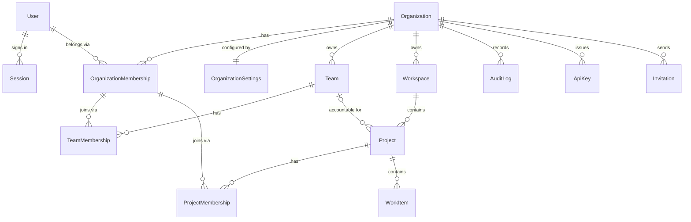

# Database

PostgreSQL 16, accessed through Prisma. The schema lives in
`packages/database/prisma/schema.prisma`; the tenant-isolation half of it is
explained in [multi-tenancy.md](./multi-tenancy.md) and not repeated here.

## Model map



Fourteen models. Three are global — `User`, `Session`, `Organization` — and the
rest carry `organizationId`.

Note that `TeamMembership` and `ProjectMembership` reference
`OrganizationMembership`, not `User` directly. Membership of a team is
predicated on membership of the organization, so removing someone from the
organization cascades them out of every team and project automatically rather
than leaving orphaned rows that grant access.

## Identifiers

Every primary key is a **UUIDv7**, generated in application code
(`packages/database/src/id.ts`) rather than by the database.

UUIDv4 is random, so inserts scatter across the B-tree and every write dirties
a different page. UUIDv7 is time-ordered in its high bits, which buys two
things:

1. **Insert locality.** Sequential inserts land on adjacent pages, which
   matters most for the append-heavy tables — `audit_logs` and `work_items`.
2. **Free chronological cursors.** `ORDER BY id DESC` is `ORDER BY created_at
DESC` without a second column, so audit-log cursor pagination is a
   single-column index scan with no tiebreaker. See
   [api.md § pagination](./api.md#-pagination).

Generating in the application, not the database, means an entity has its id
before it is persisted — so a service can build a whole object graph and write
it in one transaction without round-tripping for keys.

The cost is that ids leak approximate creation time. For this product that is
not sensitive; for one where it would be, this is the wrong choice.

## § cascade behaviour

Deletion semantics are declared on the schema rather than implemented in
services wherever possible, because a constraint cannot be forgotten.

| Relationship                                                     | Behaviour      | Why                                                      |
| ---------------------------------------------------------------- | -------------- | -------------------------------------------------------- |
| `Organization` → everything                                      | `Cascade`      | Deleting a tenant removes its data.                      |
| `Workspace` → `Project`                                          | `Cascade`      | A project cannot outlive its container.                  |
| `Project` → `WorkItem`                                           | `Cascade`      | Items are meaningless without their project.             |
| `OrganizationMembership` → `TeamMembership`, `ProjectMembership` | `Cascade`      | Leaving the organization removes every downstream grant. |
| `Team` → `Project`                                               | **`Restrict`** | See below.                                               |

**Why `Restrict` and not `SetNull` on `Project.team`.** A project's team is
optional, so `SetNull` looks right. It is not usable: on a _composite_ foreign
key, `SET NULL` nulls **every** column in the key — including the `NOT NULL`
`organizationId` — which would detach the row from its tenant. Postgres rejects
that at runtime. The constraint is therefore `Restrict`, and
`TeamsService.delete()` unassigns the team's projects explicitly inside the
deletion transaction.

This is a general hazard of composite-key tenancy and worth remembering before
reaching for `SetNull` anywhere else in this schema.

## Soft deletion

Only `Organization` is soft-deleted, via `deletedAt`.

Organization removal cascades across every tenant table, so it is staged:
marked deleted first, purged by a background job. That gives an "undo" window
for an action that is otherwise unrecoverable and affects everyone in the
tenant at once.

Nothing else is soft-deleted. Adding `deletedAt` to a model means every query
against it must remember to filter — the same class of mistake tenant scoping
exists to prevent — so it is applied only where the recovery window genuinely
earns it.

Queries that resolve organizations filter `deletedAt: null` explicitly. A
soft-deleted organization is unreachable through the API immediately, before
the purge runs.

## Timestamps

`createdAt` defaults to `now()`. `updatedAt` uses Prisma's `@updatedAt`, which
stamps the value **at write time and ignores anything supplied on create** —
worth knowing, because it silently defeated the seed script: every seeded row
was "updated" the instant the seed ran, and the overview's "recently updated"
list showed six identical timestamps. The seed now backdates with raw SQL after
the fact.

## Indexes

Beyond the primary keys and the `@@unique([organizationId, id])` keys that
composite foreign keys require, indexes follow the access patterns the API
actually has:

- `@@index([organizationId, status, createdAt])` on `Project` and `WorkItem` —
  the list screens filter by status within a tenant and sort by time.
- `@@unique([organizationId, key])` on `Project`, `@@unique([organizationId,
slug])` on `Team` and `Workspace` — human-facing identifiers are unique
  _within_ a tenant, not globally, so two organizations can both have a
  `platform` team.
- `@@unique([organizationId, userId])` on `OrganizationMembership` — one
  membership per person per organization, and the target of the composite FKs
  from `TeamMembership` and `ProjectMembership`.

Work-item numbers are allocated from a counter on the project
(`workItemCounter`) rather than a global sequence, so references read
`PORTAL-1`, `PORTAL-2` per project. Allocation happens inside the creating
transaction; the integration suite asserts gapless, unique numbering under
concurrent creation.

## Migrations

Prisma Migrate, with the migration history committed under
`packages/database/prisma/migrations/`.

```bash
pnpm --filter @atlas/database exec prisma migrate dev --name describe_the_change
```

`prisma db push` is not used outside throwaway experiments — it produces no
migration file, so the change cannot be reviewed, replayed, or rolled back.

## Local development

The Docker Compose stack in `infrastructure/` provides Postgres and Redis.
Postgres runs on **5434** rather than the default 5432, because the default
collides with anything else already running locally.

`infrastructure/docker/postgres-init/` creates a separate test database at
container initialisation. The integration suite points `DATABASE_URL` at it and
truncates freely; the harness refuses to run if the resulting URL does not name
the test database, so a misconfigured environment cannot wipe development data.

## Seeding

`pnpm --filter @atlas/database seed` loads two organizations. Northstar Systems
is a populated mid-sized platform team; Meridian Labs is deliberately sparse and
exists so a reviewer can sign in as one of its members and confirm none of
Northstar's data is reachable.

The seed is idempotent by truncation, and refuses to run against a non-local
`DATABASE_URL` unless `ALLOW_REMOTE_SEED` is set — "seed" here means "delete
everything first".

It also writes `workItemCounter` to match the rows it created, mirroring what
`WorkItemsService` does at runtime. Without that, the first work item created
through the API would collide with a seeded number.
