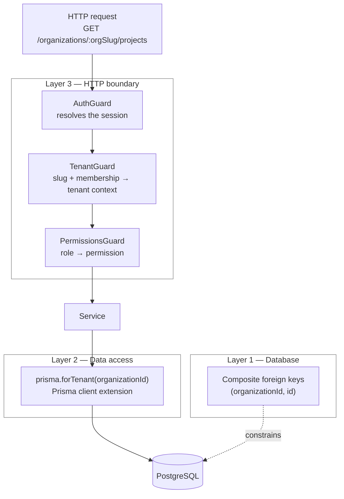

# Multi-tenancy

How ATLAS keeps one organization's data out of another's, and why it is built
this way rather than some other way.

## The shape of the problem

ATLAS is a shared-schema multi-tenant application. Every organization's rows
live in the same tables, discriminated by an `organizationId` column. The
alternative — a schema or a database per tenant — buys stronger isolation at a
cost that is not worth paying at this scale: migrations fan out across every
tenant, connection pools multiply, and cross-tenant reporting becomes a
distributed query. Shared schema keeps operations simple and puts the entire
burden of correctness on one thing: never letting a query see a row it should
not.

That burden is real. A single forgotten `WHERE organizationId = ?` is a data
breach, not a bug report. So it is not left to discipline.

## Three layers



Each layer catches something the others cannot. None of them is sufficient
alone, which is the point — a single mistake has to get past all three to
become an incident.

### Layer 1 — the database makes it unrepresentable

Every tenant-owned table carries `organizationId`, and every relationship
between two tenant-owned rows is a **composite** foreign key that includes it.

```prisma
model Project {
  organizationId String @db.Uuid
  workspaceId    String @db.Uuid

  workspace Workspace @relation(
    fields:     [organizationId, workspaceId],
    references: [organizationId, id],
    onDelete:   Cascade
  )

  @@unique([organizationId, id], name: "project_tenant_key")
}
```

The referenced key is `(organizationId, id)`, not `id`. A project in
organization A therefore _cannot_ reference a workspace in organization B —
not "is prevented from", but has no representation. Postgres rejects the row.

This costs a redundant column on every table and a wider index on every
relationship. That is the price, and it is worth it: it converts a whole class
of application bug into a constraint violation, and constraints do not forget.

One consequence worth knowing. `onDelete: SetNull` is unusable on a composite
foreign key, because SET NULL nulls _every_ column in the key — including the
`NOT NULL` `organizationId`. Where a relationship is optional and should
survive the parent's deletion, the schema uses `onDelete: Restrict` and the
service unassigns explicitly inside the transaction. `Project.team` is the case
in point.

### Layer 2 — the client cannot issue an unscoped query

Composite keys constrain _relationships_. They do nothing about a bare read:

```ts
prisma.project.findFirst({ where: { id } }); // references nothing across tenants
```

That query is relationally valid and returns whatever tenant's row matches. No
foreign key can stop it. Only a mandatory predicate can, so
`packages/database/src/tenant-scope.ts` supplies one.

`forOrganization(prisma, organizationId)` returns a Prisma client extension
that intercepts `$allOperations`. For every model in `TENANT_OWNED_MODELS` it
injects `organizationId` into the `where` of reads and into the `data` of
writes. A client obtained this way physically cannot express a cross-tenant
query.

Three details are deliberate:

**An extension, not a repository layer.** A repository would need one wrapper
method per model per operation, and isolation would then depend on every
developer choosing the wrapper over the raw client. The extension intercepts at
the driver, so there is no way around it short of asking for the unscoped
client by name — which is greppable.

**A contradictory tenant is rejected, not overwritten.** If a caller passes an
explicit `organizationId` that disagrees with the scope, the extension throws.
Silently replacing it would hide a real bug.

**The scope survives `$transaction`.** Verified, and it matters: an interactive
transaction opened on the scoped client hands the callback a `tx` that is still
scoped. Opening it on the unscoped client instead discards the whole layer, and
that mistake has been made in this codebase twice — once in `MembersService`
and once in `InvitationsService`, both caught and fixed.

**Adding a model is fail-fast.** `assertTenantModelCoverage()` runs at API
bootstrap and compares the Prisma schema against `TENANT_OWNED_MODELS` and
`NON_TENANT_MODELS`. A new tenant-owned table that nobody registered stops the
process at boot rather than quietly opting itself out of scoping.

Three models are excluded on purpose, each with its reason recorded in
`NON_TENANT_MODELS`:

| Model          | Why it is global                                                      |
| -------------- | --------------------------------------------------------------------- |
| `User`         | An identity exists independently of any organization.                 |
| `Session`      | Bound to a user, not an organization; one session spans org switches. |
| `Organization` | The tenant root. Scoping it by its own id is circular.                |

### Layer 3 — the tenant is resolved, never accepted

A request names a tenant by slug in the URL. **That slug is a claim, not a
credential.** `TenantGuard` turns it into a tenant context only by finding a
membership row proving this authenticated user belongs to that organization,
and the role comes from that row — never from anything the client sent.

Two decisions there are security-relevant:

**A non-member gets 404, not 403.** A 403 confirms the organization exists,
which lets an attacker enumerate tenants by trying slugs. One indexed query
answers "does it exist" and "are you in it" together, so the timing does not
leak what the status code hides.

**API-key callers must agree with their key.** The slug in the URL has to match
the organization the key was issued for, so a valid key cannot be pointed at
another tenant. Keys act as `VIEWER` regardless of who created them: a leaked
key must not be able to add members, mint further keys, or delete the
organization.

`requireTenant()` throws rather than defaulting, so a guard-ordering mistake
fails closed instead of silently authorising.

## Escape hatches

Some operations genuinely have no tenant yet — they are how the tenant gets
determined. These use the unscoped client, and there are exactly five against
tenant-owned models:

| Location                                         | Model                    | Why it cannot be scoped                                                                                                        |
| ------------------------------------------------ | ------------------------ | ------------------------------------------------------------------------------------------------------------------------------ |
| `common/tenancy/tenant.guard.ts`                 | `OrganizationMembership` | This query _is_ tenant resolution. Scoped by `userId`, the authenticated identity.                                             |
| `modules/organizations/organizations.service.ts` | `OrganizationMembership` | The org switcher: "which organizations am I in?" Driven entirely by membership rows, so it is inherently scoped to the caller. |
| `modules/api-keys/api-keys.service.ts` (verify)  | `ApiKey`                 | The key is the claim. This lookup produces the `organizationId` everything downstream is scoped to.                            |
| `modules/api-keys/api-keys.service.ts` (touch)   | `ApiKey`                 | Updates `lastUsedAt` by primary key, immediately after that verification.                                                      |
| `modules/invitations/invitations.service.ts`     | `Invitation`             | The token is the claim, and the recipient is not a member yet.                                                                 |

Every other unscoped call site touches `User`, `Session` or `Organization` —
global models, where demanding an `organizationId` would be meaningless.

Each of the five carries an inline `eslint-disable-next-line` naming its
reason, which is enforced by the lint rule below. That is the mechanism: an
escape hatch has to be written down in the code, not remembered.

## The lint rule

`packages/config/eslint/base.mjs` exports `prismaTenantSafetyConfig`, wired
into the root ESLint config for `apps/api/src` and `packages/database/src`. It
rejects:

- `findUnique` / `findFirst` on a **tenant-owned** model through the
  **unscoped** client with no `organizationId` in the `where`
- any use of `$queryRawUnsafe`

The selector is deliberately narrow. An earlier version fired on any
`findUnique` lacking `organizationId`, which flagged ten call sites, all of
them correct — a login lookup on `User` cannot supply an `organizationId`. A
rule that only ever fires on correct code is a rule somebody eventually
deletes, taking the real protection with it.

Note this rule guarded nothing for most of the project's life: it was written,
exported, and never imported. It is worth checking that a rule you rely on is
actually running.

## What is tested

`apps/api/test/tenancy.integration.spec.ts` runs against real Postgres and
Redis, and asserts behaviour rather than implementation:

- cross-tenant read, update, delete and role-change are all refused, with the
  target row confirmed unchanged afterwards in each case
- a foreign tenant and a nonexistent one return byte-identical 404 responses,
  so slug enumeration yields nothing
- deletion is refused even when the caller supplies the correct confirmation
  slug for a tenant they do not belong to
- membership revocation takes effect on the next request, not at session expiry

`packages/database/src/tenant-scope.spec.ts` covers the extension itself,
including the contradictory-tenant rejection and coverage assertion.

## If you are adding a model

1. Add `organizationId` and make every relationship to another tenant-owned
   model a composite foreign key.
2. Add `@@unique([organizationId, id])` so other tables can reference it.
3. Add the model name to `TENANT_OWNED_MODELS`, or to `NON_TENANT_MODELS` with
   a reason. Boot fails if you do neither.
4. Reach it through `prisma.forTenant(organizationId)`. If you think you need
   the unscoped client, you are adding a sixth row to the table above — write
   the justification inline.
